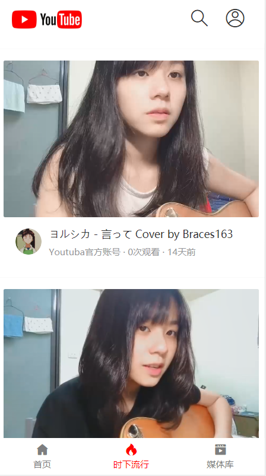
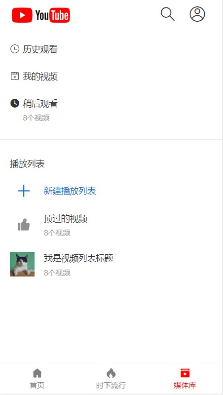

# Youtuba

项目地址 ：  http://www.bwijn.xyz/ 

api地址：	 http://api.bwijn.xyz/ 

一个仿youtube的移动端app 基于vue2.x + django rest framework  rest framework-JWT 开发

(主题已改为粉色 仿某哔哩     油管和某哩的混合体    (逃  )

##### 文档由易文档托管  多人开发协作 方便后期维护  https://easydoc.xyz/#/ 

## 项目展示








## 项目概要

- 项目初衷 用来看一些仅限港澳台地区的 [动漫] [ACG] [Cover]  
- 本项目用到的技术栈： vue-cli + vue-router + vuex + axios + vue-axios + vant( UI ) 

## 主要功能

1. 登录，
2. 注册
3. 账号个人中心
4. 保持登录状态 		
5. 多少天免登陆
6. 用户背景板
7. 渲染视频列表
8. 视频下方评论     
9. 第三方登录
10. 按赞

### 实现主流开发风格

###### 前端

1. 常用目录别名
2. Vant/Rem适配
3. scss支持、_mixin.scss、_variables.scss
4. 页面切换动画+keepAlive
5. 页面标题
6. 自动注册：自动注册路由表/自动注册Vuex/svg图标引入
7. mock server
8. axios封装、api管理
9. 用户鉴权
10. vuex-loading
11. vo-pages/dayjs/vconsole
12. 生产环境优化

###### 后端

1. [restful风格]( https://baike.baidu.com/item/RESTful/4406165?fr=aladdin )

### 待开发

1. 二级分类
2. 按赞视频保存 

### setup

```
npm install
```

### Compiles and hot-reloads for development

```
npm run serve
```

### Compiles and minifies for production

```
npm run build
```


